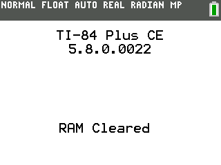

# immoral fruit
bad apple on the TI84+ CE. it runs with a whopping 32x12 resolution at 8fps. the encoder and a sample decoder are written in python and can be found in the `encoder` directory. here's a preview:

    

## faq
### why is it so bad?
everything is good when it's a learning experience.

## compilation
supply `bad_apple.mp4` into the encoder directory, and run `encoder.py`. copy `data.c` into the `src` directory, and then use the [CEDev toolchain](https://github.com/CE-Programming/toolchain) to compile.
